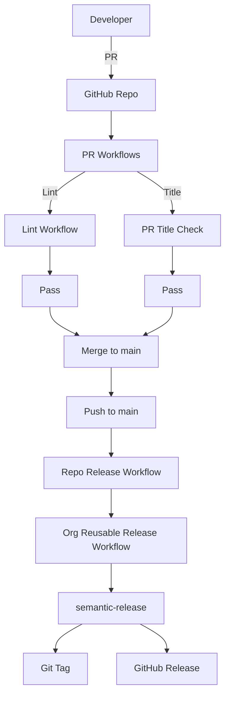

<!--



-->

```mermaid
flowchart TD
    Dev[Developer] -->|PR| GitHub[GitHub Repo]

    GitHub --> PRChecks[PR Workflows]
    PRChecks -->|Lint| Lint[Lint Workflow]
    PRChecks -->|Title| PRTitle[PR Title Check]

    Lint --> Pass1[Pass]
    PRTitle --> Pass2[Pass]

    Pass1 --> Merge[Merge to main]
    Pass2 --> Merge

    Merge --> ReleaseTrigger[Push to main]

    ReleaseTrigger --> Caller[Repo Release Workflow]
    Caller --> Reusable[Org Reusable Release Workflow]

    Reusable --> Semantic[semantic-release]
    Semantic --> Tag[Git Tag]
    Semantic --> GHRelease[GitHub Release]
```