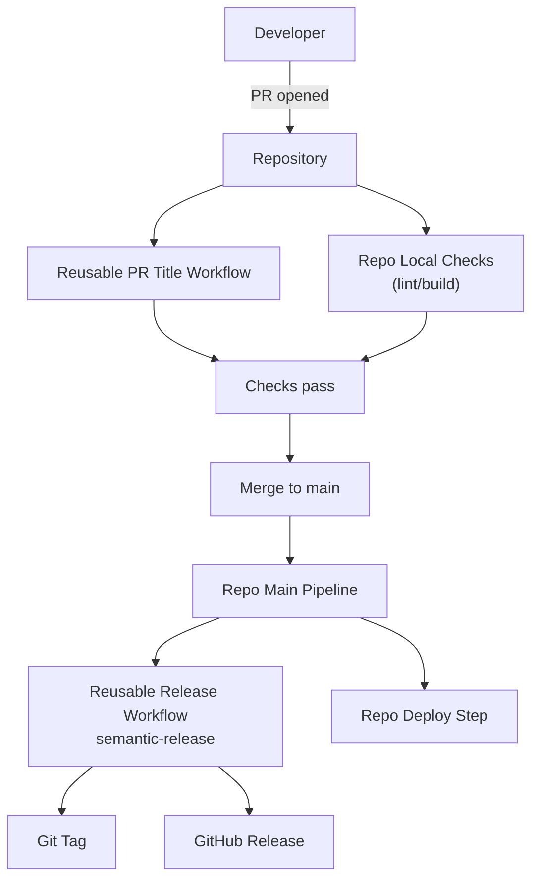

---
layout: default
title: CI/CD Architecture Diagram
---

```mermaid
flowchart TD
    Dev[Developer] -->|PR opened| Repo[Repository]

    Repo --> PRTitle[Reusable PR Title Workflow]
    Repo --> LocalChecks["Repo Local Checks<br/>(lint/build)"]

    PRTitle --> PRPass[Checks pass]
    LocalChecks --> PRPass

    PRPass --> Merge[Merge to main]

    Merge --> MainPipe[Repo Main Pipeline]
    MainPipe --> SharedRelease["Reusable Release Workflow<br/>semantic-release"]

    MainPipe --> Deploy[Repo Deploy Step]

    SharedRelease --> Tag[Git Tag]
    SharedRelease --> GHRelease[GitHub Release]
```
