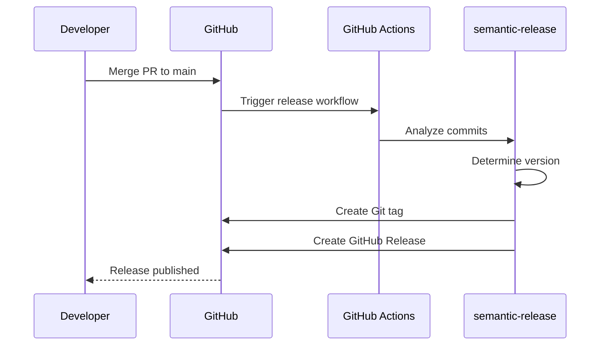

```mermaid
sequenceDiagram
    participant Dev as Developer
    participant GH as GitHub
    participant CI as GitHub Actions
    participant SR as semantic-release

    Dev->>GH: Merge PR to main
    GH->>CI: Trigger release workflow
    CI->>SR: Analyze commits
    SR->>SR: Determine version
    SR->>GH: Create Git tag
    SR->>GH: Create GitHub Release
    GH-->>Dev: Release published
```