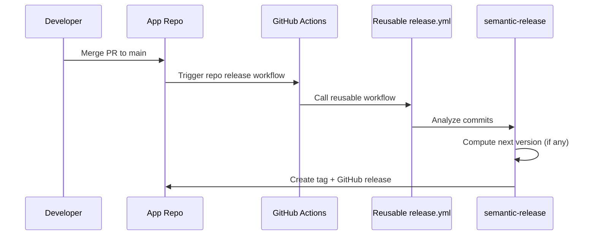

---
layout: default
title: Release Pipeline Diagram
---

```mermaid
sequenceDiagram
    participant Dev as Developer
    participant Repo as App Repo
    participant CI as GitHub Actions
    participant RW as Reusable release.yml
    participant SR as semantic-release

    Dev->>Repo: Merge PR to main
    Repo->>CI: Trigger repo release workflow
    CI->>RW: Call reusable workflow
    RW->>SR: Analyze commits
    SR->>SR: Compute next version (if any)
    SR->>Repo: Create tag + GitHub release
```
