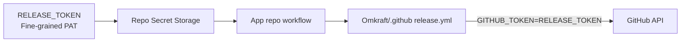

---
layout: default
title: Secrets and Permissions Flow
---

```mermaid
flowchart LR
    Token[RELEASE_TOKEN\nFine-grained PAT]
    RepoSecret[Repo Secret Storage]
    Caller[App repo workflow]
    Reusable[Omkraft/.github release.yml]
    GH[GitHub API]

    Token --> RepoSecret
    RepoSecret --> Caller
    Caller --> Reusable
    Reusable -->|GITHUB_TOKEN=RELEASE_TOKEN| GH
```
