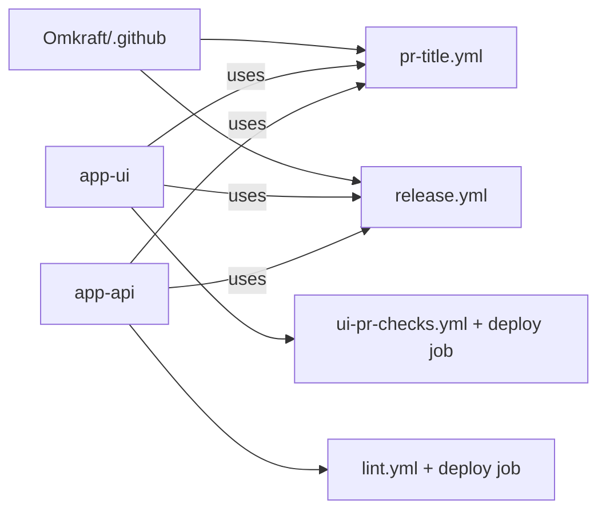

---
layout: default
title: Reusable Workflow Architecture
---

```mermaid
flowchart LR
    Org[Omkraft/.github]
    Org --> WF1[pr-title.yml]
    Org --> WF2[release.yml]

    UI[app-ui] -->|uses| WF1
    UI -->|uses| WF2
    UI --> UILocal[ui-pr-checks.yml + deploy job]

    API[app-api] -->|uses| WF1
    API -->|uses| WF2
    API --> APILocal[lint.yml + deploy job]
```
